<<<<<<< HEAD
# Praktikum Mikrotik - Winbox
**Nama** : Muhammad Qois Haidar  
**NRP** : 3122600001  
**Kelas** : 2 D4 IT A  
**Mata Kuliah** : Konsep Jaringan  

**Konfigurasi:**

**0. Connect**

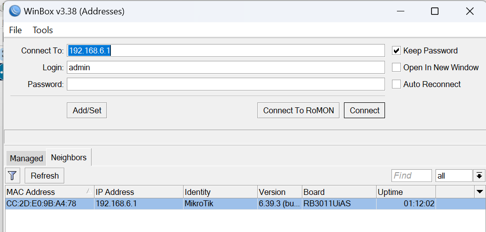

**1. Tambah Bridge**

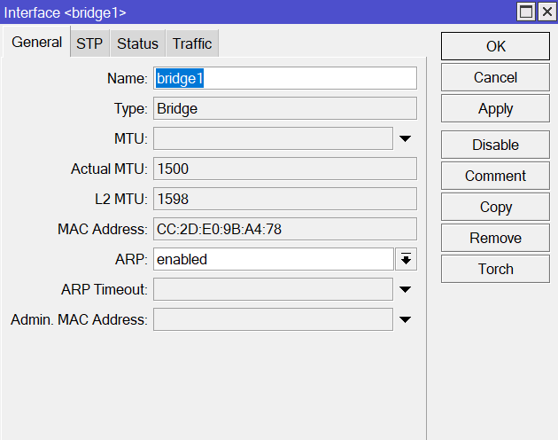

**2. Tambah dan config address**

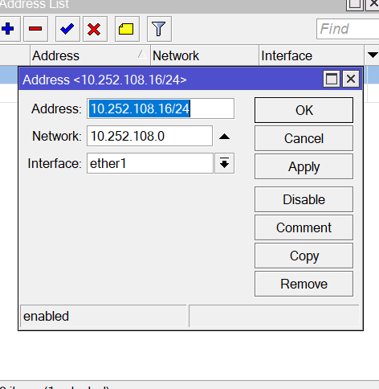
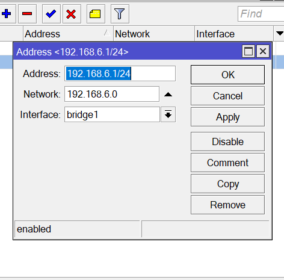
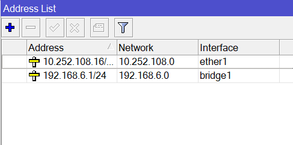

**3. Routes**
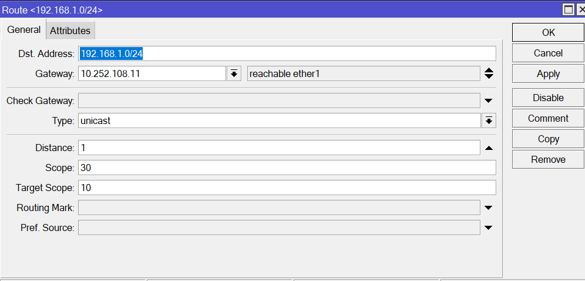
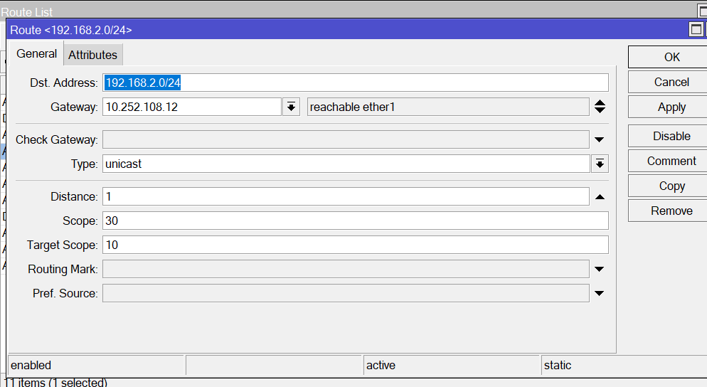
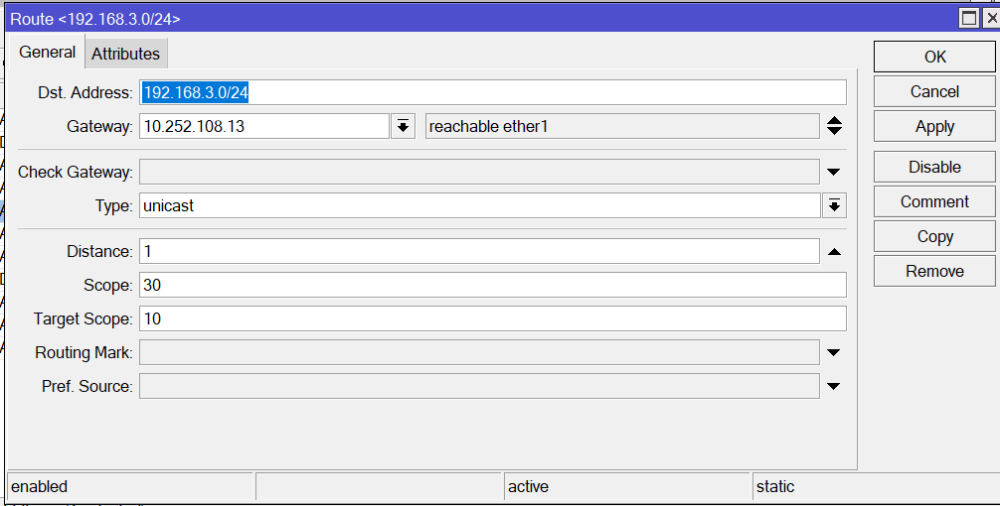

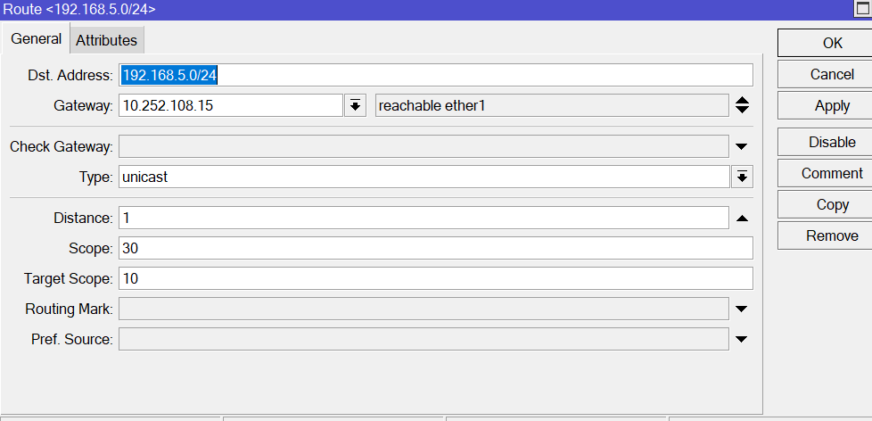
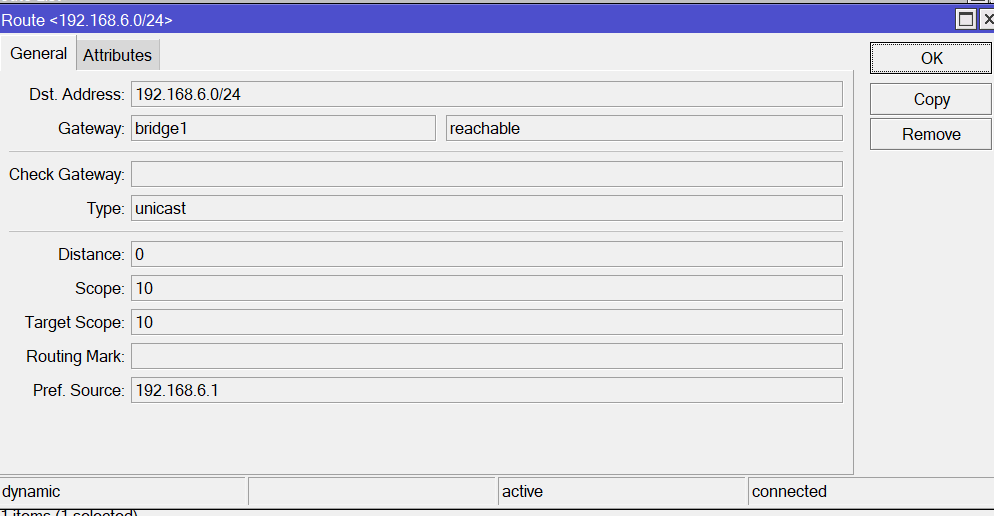
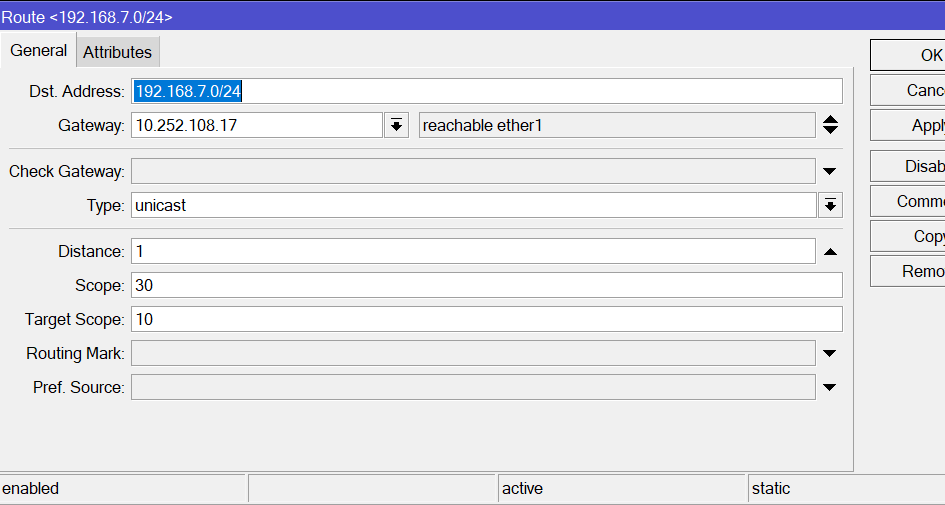
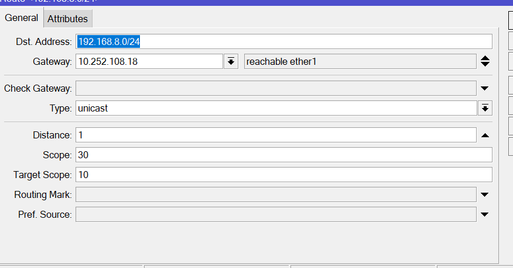
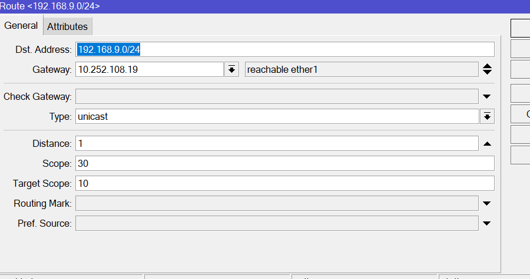
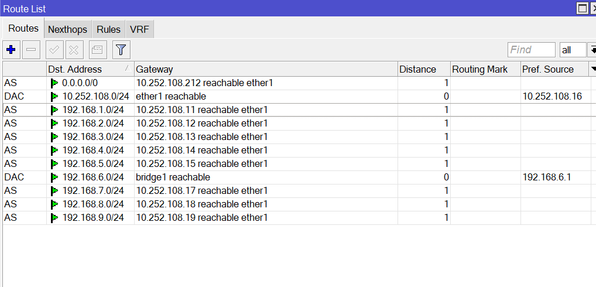

**4. Hasil**

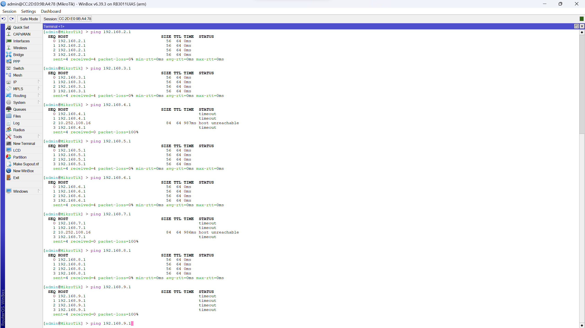
=======
# Praktikum Mikrotik - Winbox
**Nama** : Muhammad Qois Haidar  
**NRP** : 3122600001  
**Kelas** : 2 D4 IT A  
**Mata Kuliah** : Konsep Jaringan  

**Konfigurasi:**

**0. Connect**

**1. Tambah Bridge**

**2. Tambah dan config address**

**3. Routes**

**4. Hasil**

>>>>>>> 1f56d53c8b454a67824de3b12e5db8e432f73186
