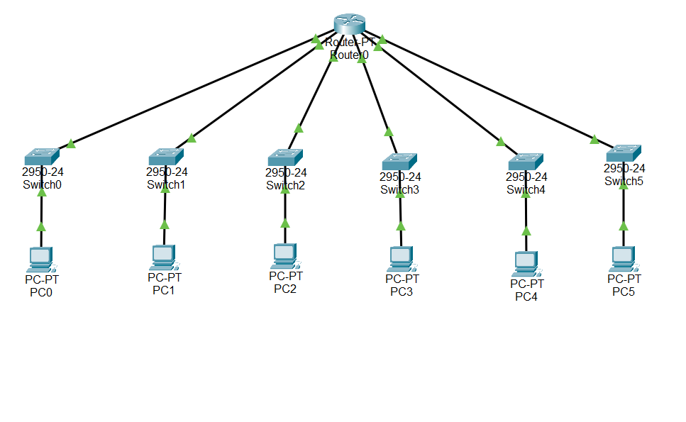

# NETWORK CONFIGURATION 6 SUBNET
**Nama** : Muhammad Qois Haidar  
**NRP** : 3122600001  
**Kelas** : 2 D4 IT A  
**Mata Kuliah** : Konsep Jaringan  

**Konfigurasi:**

1. Router 1:
   - Alamat IP: 12.0.0.1/11
   - Subnet Mask: 255.224.0.0 (/11)

2. Switch 0:
   - Subnet: 12.32.0.1/11
   - PC 1 di Switch 0:
     - IP Address: 12.32.0.2/11
     - Gateway: 12.32.0.1

3. Switch 1:
   - Subnet: 12.64.0.1/11
   - PC 2 di Switch 1:
     - IP Address: 12.64.0.2/11
     - Gateway: 12.64.0.1

4. Switch 2:
   - Subnet: 12.96.0.1/11
   - PC 3 di Switch 2:
     - IP Address: 12.96.0.2/11
     - Gateway: 12.96.0.1

5. Switch 3:
   - Subnet: 12.128.0.1/11
   - PC 4 di Switch 3:
     - IP Address: 12.128.0.2/11
     - Gateway: 12.128.0.1

6. Switch 4:
   - Subnet: 12.160.0.1/11
   - PC 5 di Switch 4:
     - IP Address: 12.160.0.2/11
     - Gateway: 12.160.0.1

7. Switch 5:
   - Subnet: 12.192.0.1/11
   - PC 6 di Switch 5:
     - IP Address: 12.192.0.2/11
     - Gateway: 12.192.0.1

## Penjelasan

- Alamat IP pada Router dimulai dari 12.32 sampai 12.192 karena kita membutuhkan 6 subnet dalam kasus ini. Kita perlu mengalokasikan alamat IP yang berbeda untuk setiap subnet ini.

- Kita menggunakan 6 subnet, dan untuk menentukan berapa banyak bit host yang harus digeser, kita menggunakan rumus 2^m - 2, di mana m adalah jumlah bit host yang digunakan untuk subnet. Tujuan dari pengurangan 2 adalah agar kita dapat menghindari alamat yang berisi semua bit host yang 0 (subnet itu sendiri) dan semua bit host yang 1 (alamat penyiar broadcast dalam subnet).

- Seiring dengan penggunaan rumus 2^m - 2, kita menentukan bahwa m harus menjadi 3 bit. Karena kita memiliki 6 subnet, kita memerlukan nilai yang mendekati 6, sehingga 2^3 - 2 adalah 6, sesuai dengan kebutuhan kita.

- Dengan menggunakan 3 bit host ini, kita dapat menciptakan 8 (2^3) alamat yang berbeda dalam setiap subnet. Namun, kita hanya menggunakan 6 dari 8 ini untuk mengalokasikan alamat IP dalam rentang 12.32 hingga 12.192, karena kita hanya membutuhkan 6 subnet.

- Subnet Mask awalnya adalah 255.0.0.0, tetapi dengan menggunakan 3 bit host yang diubah, Subnet Mask menjadi 255.224.0.0. Ini berarti 3 bit host paling kiri dalam alamat IP sekarang adalah bagian dari subnet, sehingga nilai dari 128, 64, dan 32 dijumlahkan untuk menghasilkan nilai 224 dalam Subnet Mask, yang mencerminkan penggunaan 3 bit host.

