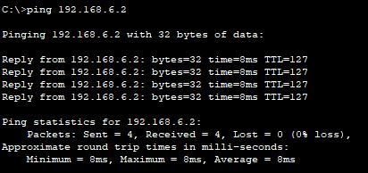

## PACKET TRACER NETWORK CONFIGURATION
**Nama** : Muhammad Qois Haidar  
**NRP** : 3122600001  
**Kelas** : 2 D4 IT A  
**Mata Kuliah** : Konsep Jaringan  
### 1 Router - 2 Switch - 4 Pc

<strong>Gambar :</strong> konfigurasi jaringan

Konfigurasi:

1. **Router Configuration:**
   - Gunakan Router-PT.
   - Konfigurasi FastEthernet 0/0 dengan alamat IP 192.168.1.1 dan subnet mask 255.255.255.0.
   - Konfigurasi FastEthernet 0/1 dengan alamat IP 192.168.6.1 dan subnet mask 255.255.255.0.

2. **Konfigurasi PC:**
   - PC0:
     - IP Address: 192.168.1.2
     - Subnet Mask: 255.255.255.0
     - Default Gateway: 192.168.1.1 (alamat IP Router pada FastEthernet 0/0)
   - PC1:
     - IP Address: 192.168.1.3
     - Subnet Mask: 255.255.255.0
     - Default Gateway: 192.168.1.1 (alamat IP Router pada FastEthernet 0/0)
   - PC2:
     - IP Address: 192.168.6.2
     - Subnet Mask: 255.255.255.0
     - Default Gateway: 192.168.6.1 (alamat IP Router pada FastEthernet 0/1)
   - PC3:
     - IP Address: 192.168.6.3
     - Subnet Mask: 255.255.255.0
     - Default Gateway: 192.168.6.1 (alamat IP Router pada FastEthernet 0/1)

3. **Hubungkan Komponen Jaringan:**
   - Hubungkan FastEthernet 0/0 pada Router dengan salah satu port pada Switch 1.
   - Hubungkan FastEthernet 0/1 pada Router dengan salah satu port pada Switch 2.
   - Hubungkan Switch 1 dengan Switch 2 menggunakan kabel straight melalui salah satu port pada masing-masing switch.
   - Hubungkan PC0 ke salah satu port pada Switch 1.
   - Hubungkan PC1 ke salah satu port lain pada Switch 1.
   - Hubungkan PC2 ke salah satu port pada Switch 2.
   - Hubungkan PC3 ke salah satu port lain pada Switch 2.

Pastikan Anda mengaktifkan semua perangkat dan koneksinya dengan benar. Setelah itu, PC di subnet 192.168.1.0 dapat berkomunikasi satu sama lain, dan PC di subnet 192.168.6.0 dapat berkomunikasi satu sama lain melalui router sebagai gateway. Jika semuanya dikonfigurasi dengan benar, jaringan Anda harus berfungsi dengan baik.

**Melakukuan Ping Test**
Setelah selesai melakukan konfigurasi, selanjutnya adalah melakukan Ping test.

**1. Ping 192.168.1.2 -> 192.168.1.3 (Broadcast)**

PC 0 (192.168.1.2) ingin ping PC 2 (192.168.6.2) di subnet berbeda. Proses melibatkan router sebagai gateway:

1. PC 0 ping ke PC 2 di subnet berbeda, menyadari bahwa perlu melewati router.

2. PC 0 menciptakan paket ICMP dengan alamat IP tujuan 192.168.6.2, tetapi tidak tahu alamat MAC router.

3. PC 0 mengirim permintaan ARP broadcast ke alamat IP router (192.168.1.1) untuk mencari alamat MAC router dalam subnetnya.

4. Switch 0 mengirimkan pesan ARP broadcast ke seluruh perangkat dalam subnet.

5. Router menerima pesan ARP, merespons dengan alamat MAC-nya.

6. PC 0 menerima respons ARP dan mendapatkan alamat MAC router.

7. PC 0 mengirimkan paket ICMP ke alamat MAC router.

8. Router menerima paket ICMP dan tahu harus mengirimkannya ke subnet 192.168.6.0.

9. Router meneruskan paket ke subnet 192.168.6.0 melalui FastEthernet 0/1.

10. Switch 2 menerima paket dan mengirimkannya ke PC 2 berdasarkan alamat MAC tujuan yang ada dalam paket ICMP.

11. PC 2 menerima paket ICMP dan merespons jika konfigurasi jaringan memungkinkan.

Proses ini melibatkan permintaan ARP broadcast hanya untuk menemukan alamat MAC router. Setelah alamat MAC router diketahui, komunikasi antara subnet berlangsung lancar melalui router.

**2. Ping 192.168.1.2 -> 192.168.1.3**

Dalam situasi ini, karena PC 0 dan PC 1 sudah saling mengenal dan memiliki informasi alamat MAC satu sama lain, tidak diperlukan mekanisme broadcast atau permintaan ARP. Paket ICMP (ping) dikirimkan langsung ke alamat MAC PC 1 melalui Switch 0 dan diterima oleh PC 1 tanpa perlu mencari tahu alamat MAC terlebih dahulu.

1. PC 0 (192.168.1.2) ingin melakukan ping ke PC 1 (192.168.1.3). Karena keduanya sudah saling mengenal, PC 0 tahu alamat MAC dari PC 1.

2. PC 0 membuat paket ICMP (ping) yang ditujukan ke alamat IP 192.168.1.3 (PC 1) dan menentukan alamat MAC tujuan yang sesuai dengan alamat MAC PC 1.

3. PC 0 mengirimkan paket ICMP ke Switch 0. Switch 0 tahu bahwa PC 1 terhubung ke port-nya dan akan meneruskan paket tersebut ke PC 1 berdasarkan alamat MAC tujuan yang telah ditentukan oleh PC 0.

4. PC 1 menerima paket ICMP dari PC 0 dan meresponsnya jika konfigurasi jaringan dan firewall memungkinkan.

**3. Ping 192.168.1.2 -> 192.168.6.2 (Broadcast)**

PC 0 (192.168.1.2) ingin melakukan ping ke PC 2 (192.168.6.2) di subnet yang berbeda. Prosesnya melibatkan router sebagai gateway:

1. PC 0 tahu bahwa untuk mencapai subnet 192.168.6.0 (tempat PC 2 berada), harus melalui router.

2. PC 0 menciptakan paket ICMP dengan alamat IP tujuan 192.168.6.2, tetapi tidak tahu alamat MAC router.

3. PC 0 melakukan permintaan ARP broadcast untuk mengetahui alamat MAC router dengan pertanyaan, "Siapa yang memiliki alamat IP 192.168.1.1?" Pesan ARP dikirim ke seluruh perangkat dalam subnet 192.168.1.0.

4. Router menerima pesan ARP broadcast dan merespons dengan alamat MAC-nya kepada PC 0.

5. PC 0 menerima respons ARP dan sekarang tahu alamat MAC router.

6. PC 0 mengirimkan paket ICMP ke alamat MAC router melalui Switch 0.

7. Router menerima paket ICMP dari PC 0 dan tahu harus mengirimkannya ke subnet 192.168.6.0.

8. Router mengirim paket ke Switch 1 melalui koneksi antara Router 0 dan Switch 1.

9. Switch 1 menerima paket dan mengirimkannya ke PC 2 berdasarkan alamat MAC tujuan dalam paket ICMP.

10. PC 2 (192.168.6.2) menerima paket ICMP dari PC 0 dan merespons jika konfigurasi jaringan dan firewall memungkinkan.

Broadcast ARP pertama kali digunakan untuk menentukan alamat MAC router, dan setelah itu, komunikasi antara PC 0 dan PC 2 berlangsung tanpa perlu mekanisme broadcast tambahan. Dalam gambar, terjadi Request Time Out (RTO) pertama kali karena ARP Caching ketika mencoba berkomunikasi dengan host yang baru. Setelah itu, komunikasi akan berjalan lebih lancar.

**4. Ping 192.168.1.2 -> 192.168.6.3**

Dalam situasi ini, ketika PC 0 dan PC 2 sudah saling mengenal dan memiliki informasi alamat MAC satu sama lain, tidak diperlukan mekanisme broadcast atau permintaan ARP tambahan. Paket ICMP (ping) dikirimkan langsung ke alamat MAC PC 2 melalui Switch 0, dan Router digunakan sebagai perantara antar subnet. Berikut langkah-langkahnya:

1. PC 0 (192.168.1.2) ingin melakukan ping ke PC 2 (192.168.6.2). Karena keduanya sudah memiliki informasi alamat MAC satu sama lain, PC 0 tahu alamat MAC PC 2 dan bahwa untuk mencapai PC 2 di subnet 192.168.6.0, ia harus menggunakan router sebagai gateway.

2. PC 0 menciptakan paket ICMP (ping) dengan alamat IP tujuan 192.168.6.2 dan menentukan alamat MAC PC 2 sebagai alamat tujuan dalam paket.

3. PC 0 mengirimkan paket ICMP langsung ke Switch 0. Switch 0 tahu bahwa PC 2 terhubung ke salah satu port-nya dan akan meneruskan paket ini ke PC 2 berdasarkan alamat MAC tujuan yang telah ditentukan oleh PC 0.

4. PC 2 (192.168.6.2) menerima paket ICMP dari PC 0 dan meresponsnya jika konfigurasi jaringan dan firewall memungkinkan.

Tidak ada permintaan ARP atau mekanisme broadcast yang diperlukan dalam situasi ini karena alamat MAC PC 2 sudah diketahui oleh PC 0 sebelumnya. Proses komunikasi menjadi lebih efisien karena tidak ada perlu mencari tahu alamat MAC lagi.

**PT-Hub**

<strong>Gambar :</strong> Pengggunaan PT-Hub

**5. Ping 192.168.1.2 -> 192.168.1.3 (PT-Hub)**

Selanjutnya akan dilakukan percobaan dengan mengganti Switch dengan PT-Hub.

Dari simulasi di atas, yang membedakan antara penggunaan Switch dengan PT-Hub adalah hub akan melakukan broadcast ke semua perangkat yang terhubung setiap kali data dikirim, bahkan jika hanya satu perangkat yang merupakan tujuan data. Sehingganmenyebabkan lalu lintas yang tidak efisien.